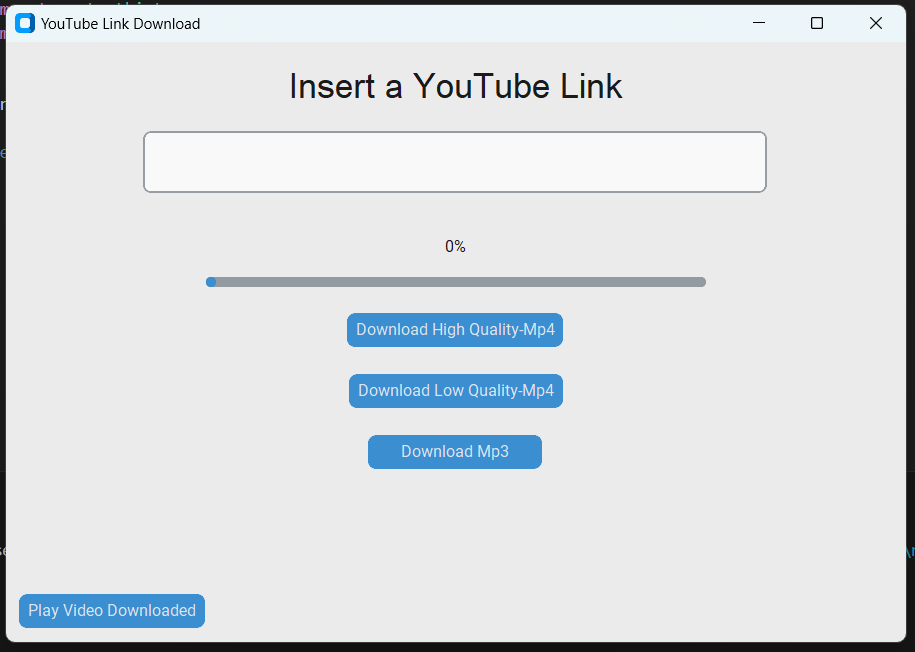
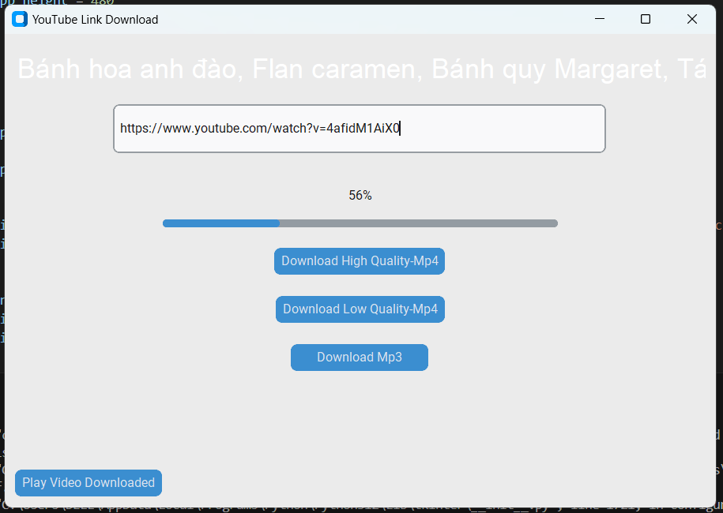
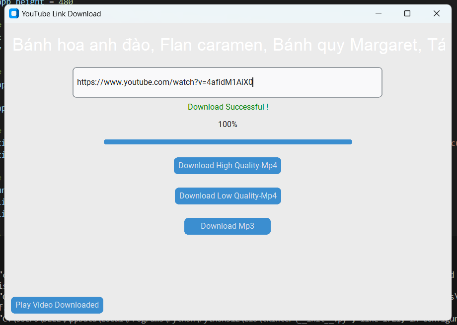
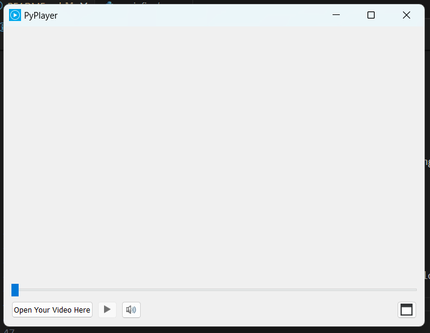
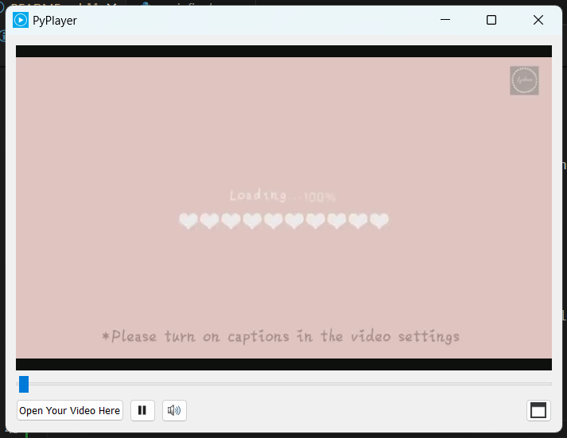

Dự án này là một ứng dụng Download & play video đơn giản, được viết bằng Python.

## Cài đặt

Cài đặt các thư viện:

> pip install pytube

> pip install PyQt5

## Tải dự án

```bash
$ git clone https://github.com/ducnguyen11101/demo-cv.git
$ cd Download_vid
$ python 3 -m venv venv
$ source venv/bin/activate
$ pip3 install .
```

## Chạy dự án

Mở Visual Studio Code.

Mở file vừa mới tải,

Vào mainfinal và bấm run.

Cửa sổ main hiện lên khi chạy chương trình 



Tại đây bạn có thể tải video từ Youtube. 

Nhập vào link video trên Youtube bạn muốn tải, sau đó chọn chất lượng video.





Tải thành công.

Bạn có thể xem video vừa mới tải bằng cách chọn nút Play Video Downloaded.



Chọn video muốn xem tại Open Your Video Here.



Bấm nút Play để xem video.


